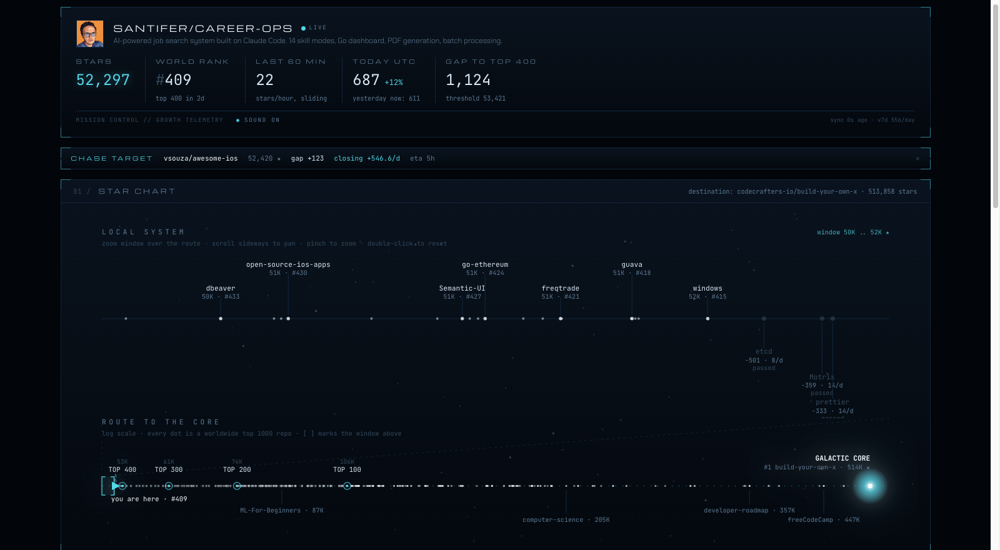

# Mission Control

**[:gb: English](#what-it-is)** | **[:es: Español](#es-versión-en-español)**

> Growth telemetry for any GitHub repository. A live star chart of your repo's journey through the worldwide ranking, with sound.



**[Live demo](https://mission-control-lovat-delta.vercel.app)** (tracking [career-ops](https://github.com/santifer/career-ops) as example tenant) · **[Scan any repo instantly](https://mission-control-lovat-delta.vercel.app/r/tinygrad/tinygrad)** by changing the URL: `/r/owner/name`

## What it is

GitHub gives you raw star data but no cockpit. Star history charts are static, Trending is a black box, and nobody shows you the repos around yours in the worldwide ranking, how fast they move, or when you pass them.

Mission Control turns the public GitHub API into a live flight console:

- **Status bar**: stars, worldwide rank, stars in the last 60 minutes, today vs yesterday at the same hour, gap and ETA to the next rank milestone. Polls every minute.
- **Star chart**: a two-band space map. The local system is a pannable zoom window (lateral scroll to pan, pinch to zoom) showing your ranking neighbors with overtake ETAs. The route to the core maps every milestone between you and the worldwide #1 repo, where every dot is a real top 1000 repository. A viewport bracket links both bands.
- **Scan cards**: hover any repo on the chart for a game-style temporal card with its avatar, description, velocity, gap and overtake date. Click to pin it as chase target with a persistent HUD.
- **Sound**: a fully synthesized Web Audio soundscape, zero audio files. Each new star is a sonar ping, ambient pad brightness follows velocity, milestone crossings play a quiet fanfare. Off by default, one click to enable. Leave the tab open and hear your repo grow.
- **Velocity, daily ladder, cumulative, heatmap, rank over time**: the full instrument panel, including the night-floor line that tells compounding growth apart from a decaying spike.
- **Replay**: re-draw the whole journey from day zero in 36 seconds, scrubber included. With sound on, ping density follows each moment's velocity.
- **Spike forensics**: every star spike is correlated with Hacker News posts, Reddit posts and your own releases, then annotated on the daily chart and in the log. The dashboard does not just show the spike, it tells you what likely caused it.
- **Mission log**: auto-detected events from telemetry. Milestone gates, neighbor overtakes, daily records, spike causes, plus a daily captain's line.
- **Engagement percentile**: your fork/star ratio ranked against the worldwide top 1000 (a real-usage signal, not a popularity one).
- **Alerts**: set an optional `ALERT_WEBHOOK_URL` secret (Discord or Slack incoming webhook) and the hourly collector notifies you of milestone gates and overtakes. There is also an RSS feed of the mission log at `/feed.xml`.
- **Mission briefing**: come back after 18 hours and get a one-line delta summary since your last visit. Stored client-side, no accounts.

### Shareable everywhere

**Embeddable badge** (SVG, edge-cached, updates hourly):

```markdown
[](https://mission-control-lovat-delta.vercel.app/r/OWNER/NAME)
```

**Embeddable live chart** (SVG, replaces a static star-history image in your README):

```markdown
[](https://mission-control-lovat-delta.vercel.app)
```

**Instant explorer** for any repo, no setup: `/r/owner/name`. **Dynamic Open Graph cards**: every shared link renders a live stats card.

## How it works

```
GitHub Actions cron (hourly)              Vercel (Next.js)
  collector/collect.mjs                     static page rebuilt on each snapshot
  snapshot -> data/history.jsonl            + live API routes (edge cached)
  commit -> push -> auto redeploy           + /api/badge + /api/og + /r/ explorer
```

A one-time bootstrap walks your entire stargazer history (one timestamp per star) and measures your worldwide rank, milestone thresholds and ranking neighbors. From then on an hourly GitHub Action appends snapshots; every commit redeploys the site. The live API routes are edge-cached, so visitor traffic never multiplies GitHub API cost.

No database. No paid APIs. No collector secrets (it uses the automatic Actions token).

## Tech Stack


## Five minute setup

1. Use this repository as a template.
2. Edit `mission.config.json`:

```json
{ "repo": "owner/name", "accent": "cyan" }
```

3. Run the bootstrap: Actions tab, run the `bootstrap` workflow (optionally passing the repo as input). Or locally: `GH_TOKEN=$(gh auth token) node collector/bootstrap.mjs`, then commit `data/`.
4. Import the repo in Vercel and add one env var: `GITHUB_TOKEN` (a fine-grained PAT with read-only access to public repositories, used by the live routes).
5. Done. The hourly `collect` workflow keeps history growing and redeploys automatically.

Local development:

```bash
npm install
GITHUB_TOKEN=$(gh auth token) npm run dev
```

## Contributing

Issues and PRs welcome. See [CONTRIBUTING.md](CONTRIBUTING.md). Some good first issues are listed in [docs/good-first-issues.md](docs/good-first-issues.md).

## License

MIT

---

# :es: Versión en Español

> Telemetría de crecimiento para cualquier repositorio de GitHub. Una carta estelar en vivo del viaje de tu repo por el ranking mundial, con sonido.

**[Demo en vivo](https://mission-control-lovat-delta.vercel.app)** (siguiendo a [career-ops](https://github.com/santifer/career-ops) como tenant de ejemplo) · **Escanea cualquier repo al instante** cambiando la URL: `/r/owner/name`

## Qué es

GitHub te da los datos de stars en crudo pero no la cabina de mandos. Las gráficas de histórico son estáticas, Trending es una caja negra y nadie te enseña los repos que rodean al tuyo en el ranking mundial, a qué velocidad van ni cuándo los adelantas.

Mission Control convierte la API pública de GitHub en una consola de vuelo:

- **Barra de estado** en vivo: stars, rank mundial, últimos 60 minutos, hoy contra ayer a la misma hora, distancia y ETA al siguiente hito.
- **Carta estelar** de dos bandas: sistema local paneable (rueda lateral para moverte, pinch para zoom) con tus vecinos de ranking y sus ETAs de adelantamiento, y la ruta al núcleo donde cada puntito es un repo real del top 1000 mundial. Un corchete-viewport conecta ambas bandas.
- **Scan cards**: hover sobre cualquier repo para una ventanita temporal estilo videojuego con avatar, descripción, velocidad y fecha de adelantamiento. Click para fijarlo como objetivo de caza con HUD persistente.
- **Sonido** 100% sintetizado con Web Audio, cero ficheros: cada star nueva es un ping de sónar, el pad ambiental sigue la velocidad y cruzar un hito suena a fanfarria serena. Apagado por defecto. Deja la pestaña abierta y escucha crecer tu repo.
- **Velocidad, escalera diaria, acumulada, heatmap, rank en el tiempo**: el panel de instrumentos completo, incluido el suelo nocturno que distingue crecimiento compuesto de pico que se apaga.
- **Replay**: el viaje entero desde el día cero en 36 segundos, con scrubber. Con sonido, la densidad de pings sigue la velocidad de cada momento.
- **Mission log**: eventos auto-detectados (hitos, adelantamientos, récords diarios) más una línea diaria de bitácora.
- **Briefing diario**: vuelve tras 18 horas y te resume los deltas desde tu última visita. Todo en el cliente, sin cuentas.

### Compartible en todas partes

**Badge embebible** para READMEs (SVG cacheado, se actualiza cada hora), **explorer instantáneo** `/r/owner/name` para cualquier repo sin instalar nada, y **tarjetas Open Graph dinámicas** con las stats en vivo en cada link compartido.

## Setup en 5 minutos

1. Usa este repositorio como plantilla.
2. Edita `mission.config.json` con tu `owner/name`.
3. Ejecuta el workflow `bootstrap` desde la pestaña Actions (o en local con `GH_TOKEN=$(gh auth token) node collector/bootstrap.mjs` y commitea `data/`).
4. Importa el repo en Vercel y añade la variable `GITHUB_TOKEN` (PAT fine-grained de solo lectura de repos públicos).
5. Listo. El workflow horario `collect` mantiene el histórico y redespliega solo.

Sin base de datos, sin APIs de pago, sin secrets para el collector.

## Licencia

MIT

## Let's Connect

[](https://santifer.io)
[](https://linkedin.com/in/santifer)
[](mailto:hola@santifer.io)
